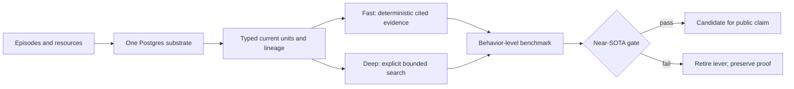

# MemPhant Near-SOTA Program Design

## Goal

Consolidate the repository into one authoritative, pushed trunk, then obtain a
credible near-SOTA signal on at least one public 2026 benchmark without adding a
second memory engine or mistaking a saturable retrieval proxy for product value.

## Decision

Use one Postgres-backed, bitemporal substrate. Keep deterministic Fast recall as
the default and explicit Deep recall as the accuracy-first escape hatch. Stop
optimizing keys, fusion, and local rerankers on Track R and MemoryCode: those
instruments have answered their questions and are structurally saturated.

The next product hypothesis is behavior-changing memory whose gold depends on
evidence outside the current statement set: evolving preferences, scoped rules,
negative constraints, aggregate state, and proactive application. This matches
the user-visible job better than another fact-retrieval arm.

## Evidence basis

- LongMemEval-V2 evaluates 451 questions across static state, dynamic state,
  workflows, gotchas, and premise awareness. Its official metric rewards the
  accuracy-latency frontier, not accuracy alone:
  <https://arxiv.org/abs/2605.12493> and
  <https://xiaowu0162.github.io/longmemeval-v2/>.
- PERMA evaluates evolving preferences across time, domains, noise, and
  interactive task completion rather than static preference retrieval:
  <https://arxiv.org/abs/2603.23231>.
- User as Code shows why executable aggregate state and proactive rules can beat
  retrieval-only memory, but MemPhant must express that value through its
  existing typed units, lineage, and projections rather than adding a Python
  state engine: <https://arxiv.org/abs/2606.16707>.
- MemoryAgentBench separates retrieval, test-time learning, long-range
  understanding, and selective forgetting. MemPhant claims must remain split by
  these capabilities: <https://mlanthology.org/iclr/2026/hu2026iclr-evaluating/>.

## Architecture

No SQLite, graph database, vector service, executable Python state store, or
benchmark-specific mutation path is added. `InMemoryStore` remains a test fake,
not a second production substrate or a basis for storage claims.

## User experience contract

Accuracy and user-visible correctness dominate every other axis. The preferred
experience is:

1. The agent remembers a durable rule without the user repeating it.
2. Corrections replace the old rule without resurrecting it.
3. Scoped exceptions apply only where intended.
4. Negative constraints prevent the wrong action.
5. The agent can proactively surface a relevant constraint.
6. Every applied memory has a correction handle and verifiable receipt.
7. Fast remains the default; Deep is explicit, bounded, cancellable, and uses
   the same cited-evidence response contract.

Cost and latency are optimization constraints after correctness. The official
target is a positive LongMemEval-V2 LAFS contribution or accuracy within three
percentage points of the reverified best comparable system at materially lower
latency/cost. Security is never removed, but pre-production work does not spend
cycles on speculative hardening ahead of the behavior gate.

## Workstreams and order

### A. Consolidate and publish

Land complete S1b and MiniLM negative evidence, recover nothing from the fully
contained stash, remove non-input scratch files and transient logs, run the full
repo gate, and push the single trunk. Preserve benchmark caches outside the repo.

### B. Acquire a discriminating preference instrument

Audit PERMA's exact license, immutable revision, data shape, and evaluator. Build
only a Stage-0 adapter round trip first. The adapter must map public events to the
existing retain/correct/recall contracts and must score end behavior. It may not
derive gold from the same statements offered to the retriever.

The private Track U bank remains a coarse smoke only. Its 51 goldens cannot
resolve a 7-point effect; it may support a preregistered roughly 15-point screen
only if independent units can reach the required count without duplicating a
source file.

### C. Resume the official environment-memory path

After trunk is stable, recensus the paused LongMemEval-V2 v5 campaign at zero
spend, fix the retry/adjudication root cause with live-shaped tests, resume only
the exact unresolved set, then run paired Fast/Deep reader and official 451-row
evaluation. Never score the survivor-only prefix.

## Gates

| Gate | Advance when | Stop when |
|---|---|---|
| Repository | Full verification passes and `origin/main` equals local main | Any in-scope failure or unresolved branch/stash lineage |
| Instrument | License artifact pinned, gold external to statement set, Stage-0 round trip exact, power reachable | Card-only license, saturable gold, or unreachable sample size |
| Preference smoke | End-behavior gain clears preregistered effect and no scope/negative-constraint regression | CI crosses zero or safety/correction behavior regresses |
| LongMemEval-V2 | Complete 451 rows, settled cost, comparable frontier reverified | Partial matrix, unresolved accounting, or kill gate makes target unreachable |
| Near-SOTA | Positive LAFS contribution or within 3pp accuracy at materially better cost/latency | Comparator remains clearly superior on accuracy and operating cost |

## Status ownership

`docs/superpowers/specs/memphant/STATUS.md` remains the only state ledger. It
will carry a compact current dashboard across surfaces, memory kinds, storage,
and the keys-to-reader pipeline. Proof and contracts stay in their existing
owner documents.

## Non-goals

- No more threshold, fusion, embedding, or reranker arms on Track R or
  MemoryCode without a new discriminating instrument.
- No global or storage SOTA claim.
- No migration of Syndai surfaces before a behavior-level gate wins.
- No new dependency or service for a capability the existing runtime provides.
