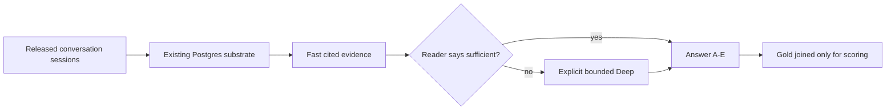

# HorizonBench Belief-Update Pilot Design

## Goal

Reopen HorizonBench under the owner's license waiver and test whether the
existing MemPhant runtime can improve long-horizon evolving-preference answers
with one fixed reader, without exposing generator gold or adding a second
memory engine.

## Decision

Run the official ten-row sample as a construction and kill-gate pilot before
touching the 4,245-row benchmark. Compare three prompt arms with the same
`anthropic/claude-opus-4.5` reader:

1. `full_context`: the official conversation-plus-options prompt.
2. `fast`: only evidence returned by MemPhant Fast plus the official options.
3. `selective_deep`: ask the reader whether Fast evidence is sufficient; reuse
   its answer when it is, otherwise explicitly invoke bounded Deep and answer
   from the resulting evidence.

The pilot has a $25 total ceiling: at most $22 for reader calls and at most ten
Deep invocations, each bounded by the runtime's $0.30 limit. The complete
benchmark remains unauthorized until the pilot passes its preregistered gate.

## Gold quarantine

Only `id`, `user_id`, `generator`, `conversation`, and `options` may enter
ingest, recall, Deep, or reader prompts. `correct_letter`,
`distractor_letter`, `has_evolved`, `preference_domain`, and
`preference_evolution` are scoring-only. The runner constructs an immutable
prompt payload before joining predictions to gold, and tests assert that no
scoring-only field or value is serialized into that payload.

Each item gets an isolated bound subject and scope. This deliberately avoids
cross-item leakage when multiple benchmark questions share a simulated user;
`user_id` is retained only as the statistical cluster key. Sessions are
ingested once per item in their released chronological order. No mental-state
graph is downloaded or read.

## Dataset and completeness contract

The source is the official `sample/test` split at Hugging Face dataset revision
`50941f00f90c03a5a60219d76393869b757b835a`. The acquisition step writes a
canonical local JSONL copy outside the repository cache and records its SHA-256,
ten expected IDs, user IDs, row count, and source endpoints in a committed lock.

Every arm must end with exactly one terminal record for every expected ID.
Duplicate, missing, unexpected, malformed, or partially resumed records abort
scoring. Provider replies are cache-bound to their authorization and paid
attempt ledger. Results are paired by item and inference is clustered by
`user_id`; the ten-row sample is diagnostic only and cannot promote a SOTA
claim.

## Existing-runtime path

The implementation reuses `gate_runtime.py` for scratch PostgreSQL, packaged
server/worker lifecycle, context binding, retain, drain, and recall. It reuses
`run_reader.ReaderCli` plus `provider_attempts.py` for provider pinning, strict
structured replies, caching, reservations, settlement, and durable provenance.
No new dependency, service, table, memory kind, or product default is added.

## Pilot gates

The $0 gate runs first and must prove:

- exact ten-row source census and prompt quarantine;
- every released conversation parses into dated sessions;
- every session fits the public retain boundary;
- Fast completes for every item without degraded responses;
- all expected IDs produce non-empty evidence; and
- the resulting prompt bank contains no scoring-only fields.

Only then may paid execution start. The paid pilot advances to a larger,
separately preregistered user-clustered run only if all of these hold:

- all three arms complete 10/10 with priced provider attempts and total settled
  plus worst-case unsettled liability at or below $25;
- `selective_deep` has no more pre-evolution-distractor selections than
  `full_context` on evolved rows;
- `selective_deep` is at least as accurate as `full_context` overall and gains
  at least one paired item; and
- no answer is scored from an incomplete, degraded, capped, partial, or invalid
  Deep result.

Failure is useful evidence: stop, register the result, keep SOTA false, and do
not tune on the sample. Passing authorizes only a powered plan, not a claim.

## Claim boundary

The published comparison bars are 52.8% overall and 51.3% on evolved
preferences. A future complete result may claim HorizonBench SOTA only above
the corresponding published bar with complete rows and user-clustered
uncertainty. A same-reader paired lift below those bars is a MemPhant mechanism
signal, not SOTA. A post-release reader's absolute score is reported with a
training-contamination caveat.

